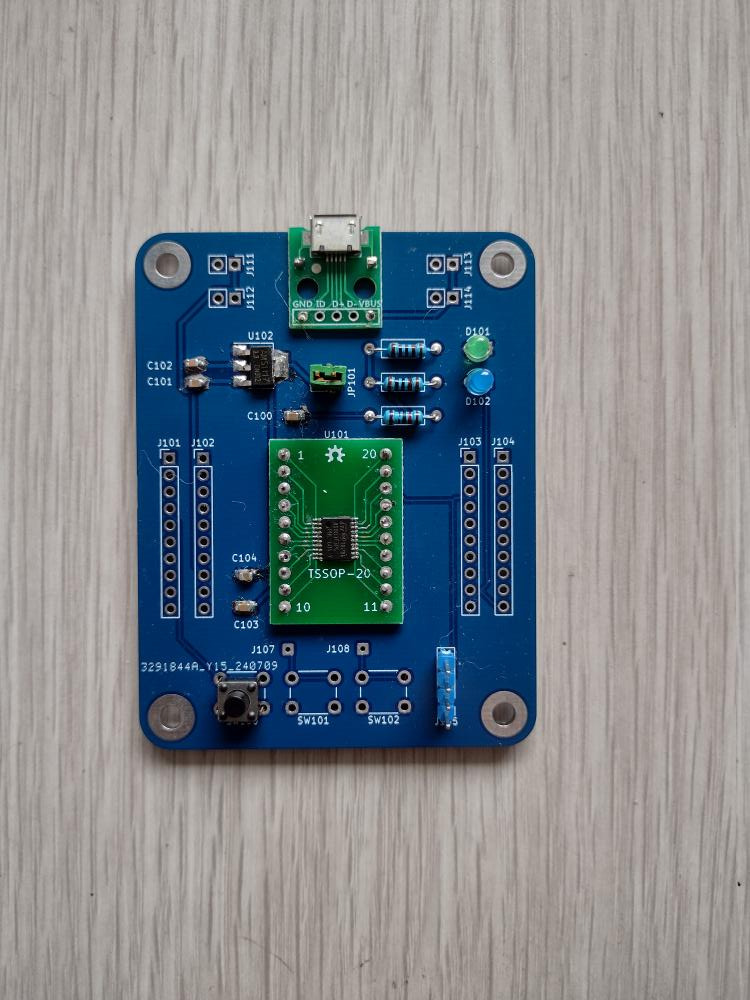

## Large STM8S103F3P6 development board

This is a large version of the STM8 "Blue Pill", not to be confused with the STM32 "Blue Pill". I designed this mainly to get more connection points: 2 header pads for each STM8 pin, 4 sets of power supply headers for connecting peripherals, and 2 uncommitted tactile button positions. Small size wasn't important to me; I wanted something to build gadgets using the STM8S103F3P6 chips I had.

The jumper bridge between +5v ad +3.3V is used when you want to run the MCU at 5V, perhaps to connect to 5V peripherals. For downloading the firmware to the MCU, the STlink dongle will provide 3.3V. Do not connect both the dongle and the micro-USB power at the same time.

This is a mixed design. The capacitors are SMT while the resistors and LEDs are THT; they were what I had handy. The micro-USB connector is an adaptor you can buy from the usual outlets for easier soldering. The MCU footprint is hybrid: there are TSSOP-20 pads but also 20 THT pads for an adaptor board so that you or a skilled friend can solder that separately.

Thus I don't expect that the design will suit everybody or even anybody as is, but I'm publishing it so that people can have KiCad design info to remix into their own design.
